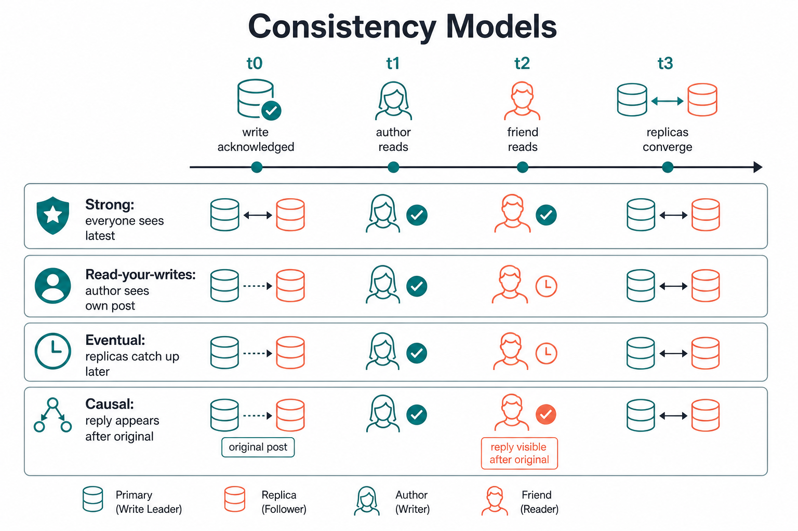

# Consistency Models

> Consistency is not binary. It’s a **spectrum of promises** about when a write becomes visible to which reads.

## Plain English

After you write data, *who* sees it and *when*?

| Model | Promise (simple) | Everyday analogy |
|-------|------------------|------------------|
| **Strong** | After a write ACK, every subsequent read (anywhere that participates) sees it | Updating a whiteboard in a meeting — everyone looks at the same board |
| **Eventual** | If writes stop, replicas converge; until then reads may be stale | Gossip — eventually everyone hears the news |
| **Causal** | If B happened because of A, everyone sees A before B | You reply to a comment — nobody sees the reply without the original |
| **Read-your-writes** | *You* always see your own writes | After posting, *your* refresh shows the post (friends might lag) |
| **Monotonic reads** | Once you saw version N, you never go back to older | You don’t “unsee” a deleted story, then see it again |
| **Monotonic writes** | System applies your writes in order | Edit 1 then Edit 2 — never apply Edit 2 first |

**Session guarantees** (common product combo): read-your-writes + monotonic reads for one user/session — enough for many social apps without global strong consistency.

## Diagram: visibility timeline



```text
  t0  User A writes post P  ──► primary ACK
  t1  User A refreshes
  t2  Friend B refreshes
  t3  All replicas catch up

  Strong:           A and B both see P from t0+ (after ACK)
  Read-your-writes: A sees P from t1; B might miss until t3
  Eventual:         A or B might miss until sometime ≤ t3
  Causal:           If B likes P, nobody sees "like" without seeing P
```

```text
                    Strong
                      │
                      │  harder / slower / more coordination
                      │
                 Causal
                      │
              Session / RYW
                      │
                 Eventual
                      │
                      ▼  easier / faster / more available
```

## Simple examples

### 1) Bank transfer — strong

Transfer ₹500 A → B. After success, both balances must reflect it. Eventual here can show “money vanished” for a moment → support tickets and fraud risk.

### 2) Instagram like count — eventual

Like counter off by 1 for 2 seconds is fine. Prefer AP + eventual.

### 3) Comment thread — causal

```text
Alice: "Anyone in Bangalore?"
Bob:   "Yes, free at 5"   ← must not appear before Alice’s question
```

Causal consistency preserves “happens-before.” Eventual *without* causal can reorder and confuse.

### 4) “I posted but don’t see it” — read-your-writes / sticky session

Classic bug: write hits primary in US-East; next read hits a lagging replica. Fix options: sticky routing, “read from primary after write,” version tokens, or session store.

## Why prefer one over the other

| Need | Prefer | Why not the alternative |
|------|--------|-------------------------|
| Money, seats, unique username | Strong | Eventual → double-book / duplicate username |
| Global feed at low latency | Eventual (+ session for author) | Strong cross-region → high p99 |
| Replies / threads / multi-step UX | Causal or session | Pure eventual can reorder related events |
| “Refresh shows my edit” | Read-your-writes | Strong everywhere is overkill if only *you* need it |

**Senior move:** Don’t say “we need consistency.” Say **which model for which read path**.

## Trade-offs

| Model | Upside | Downside |
|-------|--------|----------|
| Strong | Simple mental model; correct by default | Latency, availability under partition, cost |
| Eventual | Fast, available, multi-region friendly | Stale reads; conflict repair |
| Causal | Preserves story order without full global sync | Metadata (version vectors); more complex |
| Session / RYW | Great UX for the acting user; cheaper than global strong | Others may still see lag; needs session affinity or tokens |

## Interview trigger phrase

> “I’d use **strong consistency** for seat inventory, **eventual** for like counts, and **read-your-writes** so the author always sees their own post — I won’t pay Spanner latency for a like counter.”

## Exercise

**Design a collaborative notes app (Google Docs–lite).**

1. For “cursor presence / who’s online,” pick a model and justify in one line.
2. For “character-level edits,” which model (or CRDT approach) fits — and what breaks if you only use last-write-wins?
3. For “export PDF of the final doc,” do you need stronger guarantees at that moment? Why?
