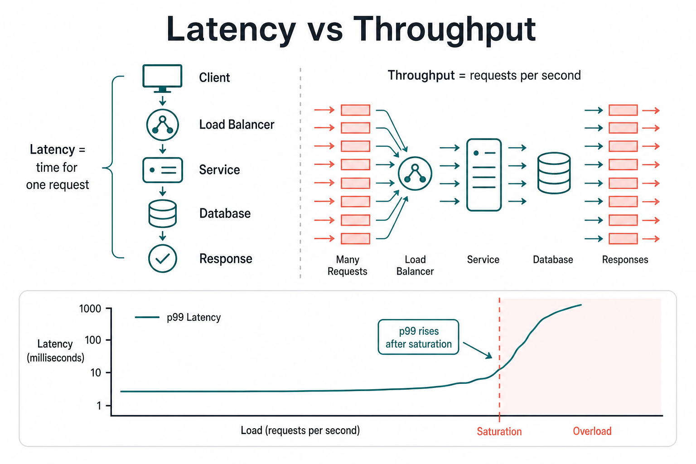

# Latency vs Throughput

> **Latency** = how long one request waits. **Throughput** = how many requests you finish per second. Optimizing one can hurt the other.

## Plain English

| Term | Question it answers | Units |
|------|---------------------|-------|
| **Latency** | How slow was *this* request? | ms (often **p50 / p95 / p99**) |
| **Throughput** | How much work can the system do? | QPS, RPS, msgs/sec, MB/s |



```text
  One request journey
  Client ──► LB ──► Service ──► DB ──► Response
            |←———— latency (e.g. 80ms) ————→|

  Many requests over time
  ████████████████  →  throughput = 12,000 QPS
```

**Little’s Law intuition:**  
`concurrency ≈ throughput × latency`  
If each request takes 100ms and you want 10k QPS, you need ~1000 in-flight requests (connections, threads, or async slots).

## Simple example

A photo upload API:

| Design | Latency | Throughput |
|--------|---------|------------|
| Sync: resize + upload to S3 in the HTTP request | High (2–5s) | Low — workers blocked |
| Async: accept upload fast, queue resize | Low for API (~50ms) | High — API frees quickly; workers scale separately |

Same product feature — different latency/throughput profile.

### Batching vs one-by-one

```text
  One-by-one DB inserts     Batch 100 inserts
  Latency per item: low     Latency per item: higher (wait to fill batch)
  Throughput: medium        Throughput: much higher
```

Analytics pipelines batch for throughput. Chat message send optimizes latency.

## Why prefer one over the other

| Optimize for **latency** when… | Optimize for **throughput** when… |
|--------------------------------|-----------------------------------|
| User is waiting on the critical path (checkout, search typeahead) | Bulk jobs, log ingest, ML training data, overnight ETL |
| SLA is “p99 < 200ms” | SLA is “process 1B events/day” |
| Interactive UX | Cost efficiency of pipelines |

**Why not always low latency?** Techniques that cut latency (no batching, sync calls, more replicas close to user) cost money and can *lower* total throughput per machine.

**Why not always max throughput?** Giant batches and queues make each user wait longer.

## Trade-offs (interview table)

| Technique | Helps | Hurts |
|-----------|-------|-------|
| Caching | Latency (and often throughput) | Stale data; invalidation complexity |
| Batching / buffering | Throughput | Per-item latency |
| Async queues | API latency + system throughput | End-to-end “job done” latency |
| More concurrency | Throughput (until saturation) | Tail latency (queueing, lock contention) |
| Fan-out to many services (sync) | — | Latency (p99 = sum/max of deps) |

**Tail latency:** p99 matters more than average. One slow dependency (GC pause, lock, cold cache) dominates user pain even if average looks fine.

## Diagram: saturation

```text
  Latency
    ▲
    │                    ╱  (queueing explodes)
    │                  ╱
    │                ╱
    │         ______╱
    │  ______/
    └──────────────────────► Load (QPS)
         comfortable   ←→  overload

  Past ~70–80% capacity, latency rises non-linearly.
```

## Interview trigger phrase

> “I’d optimize the **read API for p99 latency** with cache + CDN, and the **image pipeline for throughput** with a queue and batch workers — same product, different goals.”

## Exercise

**Design “upload video → viewers can watch.”**

1. Split the path into: (a) upload ACK to user, (b) transcoding, (c) first playback. For each, is the goal latency or throughput?
2. If transcoding is sync inside the upload request, what happens to p99 and to how many uploads you can accept?
3. Name one change that improves throughput of ingest but might worsen time-to-first-play.
