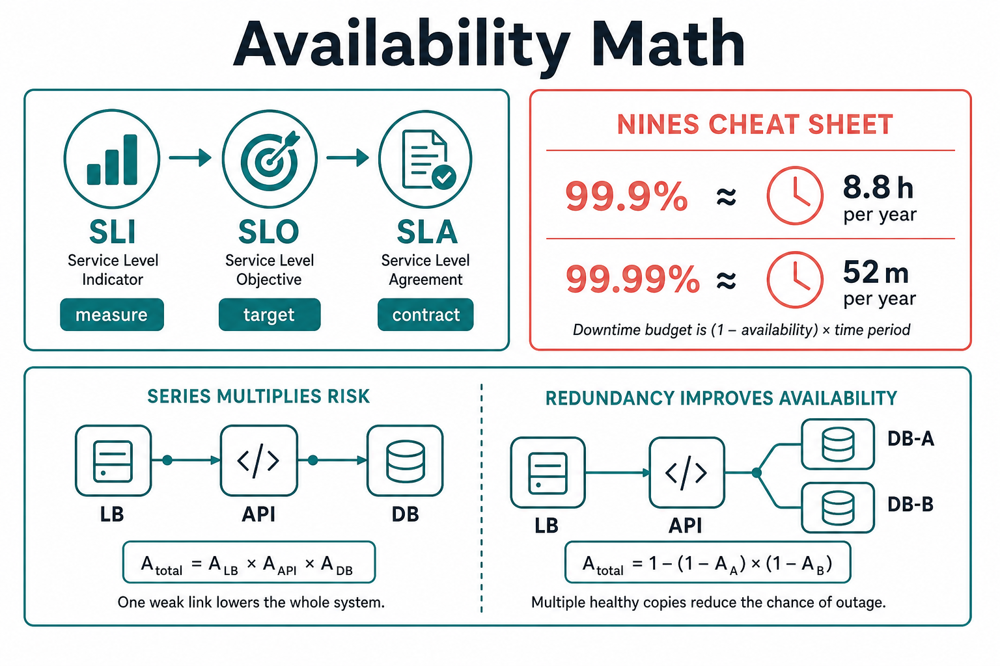

# Availability Math (Nines, SLA / SLO / SLI)

> Availability is a **budget**. “Four nines” is not a vibe — it’s ~52 minutes of allowed downtime per year.

## Plain English

| Term | Who uses it | Meaning |
|------|-------------|---------|
| **SLI** | Engineers | The *metric* you measure (e.g. % of successful HTTP requests) |
| **SLO** | Eng + product | The *target* (e.g. 99.9% success over 30 days) |
| **SLA** | Legal / sales | The *contract* with customers (credits if you miss) |



```text
  Measure (SLI)  →  Target (SLO)  →  Promise (SLA)
     "99.95% of     "We aim for      "If < 99.9%,
      checkouts       99.9%"           customer gets
      succeed"                         service credit"
```

**Nines cheat sheet** (approximate allowed downtime):

| Availability | Downtime / year | Downtime / month |
|--------------|-----------------|------------------|
| 99% (2 nines) | ~3.65 days | ~7.3 hours |
| 99.9% (3 nines) | ~8.8 hours | ~43 minutes |
| 99.99% (4 nines) | ~52 minutes | ~4.4 minutes |
| 99.999% (5 nines) | ~5 minutes | ~26 seconds |

## Diagram: series vs parallel

Availability of components **in series** multiplies (gets worse).  
Redundant components **in parallel** improve overall availability.

```text
  Series (all must work):
  [ LB 99.99% ] → [ API 99.9% ] → [ DB 99.9% ]
  Overall ≈ 0.9999 × 0.999 × 0.999 ≈ 99.88%   ← worse than weakest link

  Parallel (either replica OK):
        ┌→ [ DB-A 99% ]─┐
  ─────┤                ├──→ overall ≈ 1 − (0.01×0.01) = 99.99%
        └→ [ DB-B 99% ]─┘
```

**Interview insight:** Adding hops (API gateway → service → cache → DB → search) *eats* your nines unless you add redundancy and graceful degradation.

## Simple example

You promise **99.9%** monthly for checkout.

- Month ≈ 43,200 minutes → error budget ≈ **43 minutes** of full outage *or* equivalent failed requests.
- A 1-hour bad deploy blows the monthly budget → you should freeze risky launches and focus on reliability.

That’s why seniors talk about **error budgets**, not “always 100%.”

## Why this framing is preferred

| Vague talk | Better senior talk |
|------------|--------------------|
| “We’ll make it highly available” | “SLO 99.9% success for `checkout`; SLI = non-5xx within 2s” |
| “Five nines everywhere” | “Five nines on the payment path costs multi-region active-active; feed can be 99.9%” |
| “Uptime = server up” | “Uptime = *user success* — slow timeouts count as failure too” |

**Why not chase max nines everywhere?** Cost explodes (multi-region, hot standbys, 24/7 ops). Match nines to **business criticality**.

## Trade-offs

| Choice | Gain | Cost |
|--------|------|------|
| Higher SLO | Happier users, stronger enterprise deals | Redundancy, testing, slower feature velocity when budget is burned |
| Looser SLO | Faster shipping, cheaper infra | More incidents “allowed”; enterprise may reject |
| Multi-region active-active | Survive region loss | Consistency complexity, higher spend |
| Graceful degradation (cached feed) | Keeps *partial* availability | Weaker consistency / reduced features during failure |

## Interview trigger phrase

> “I’d set an **SLO of 99.9%** on checkout with an SLI of successful responses under 2s — that’s ~43 minutes of error budget a month, so a bad deploy forces us into reliability mode.”

## Exercise

**You design a URL shortener for a company that sells a 99.99% SLA on redirects.**

1. Convert 99.99% to roughly how many minutes of downtime per year you can afford.
2. List three components on the redirect hot path. Are they series or parallel? What does that do to overall availability?
3. Propose one graceful-degradation idea if the analytics writer is down — does redirect availability still hold?
