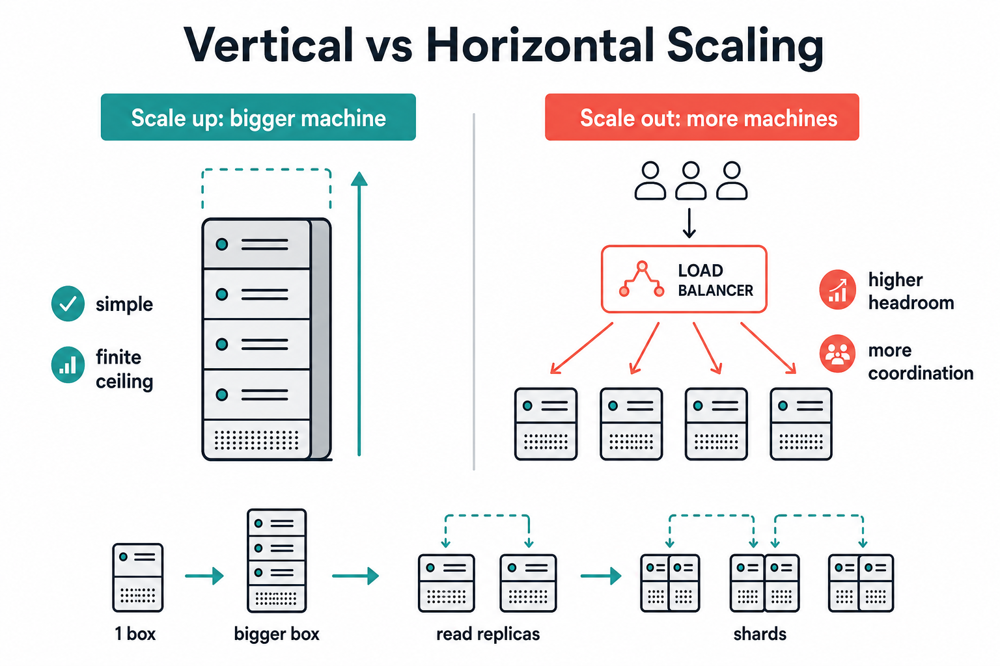

# Vertical vs Horizontal Scaling

> **Vertical** = bigger machine. **Horizontal** = more machines. At senior scale, you almost always **scale out** — and that forces sharding, stateless services, and distributed-systems trade-offs.

## Plain English

| | Vertical (scale **up**) | Horizontal (scale **out**) |
|---|-------------------------|----------------------------|
| Action | Add CPU / RAM / disk to one node | Add more nodes |
| Mental model | One powerful box | A fleet behind a load balancer |
| Ceiling | Hardware max; expensive top-end | Much higher (in theory) |
| Failure mode | That one box dies → big outage | Lose one node → partial capacity |



```text
  Vertical                         Horizontal
  ┌─────────────┐                  ┌────┐ ┌────┐ ┌────┐
  │  Big DB     │                  │ n1 │ │ n2 │ │ n3 │
  │  64 → 128   │                  └──┬─┘ └──┬─┘ └──┬─┘
  │  cores      │                     └──────┼──────┘
  └─────────────┘                            ▼
                                       Load balancer
```

## Simple example

Your users table is 2 TB and write QPS is climbing.

| Approach | What you do | What happens next |
|----------|-------------|-------------------|
| Vertical | Buy a larger RDS instance | Works until you’re on the biggest SKU and still hot |
| Horizontal | **Shard** users by `user_id % N` across N databases | Writes spread out; app must route to the right shard |

**Caching / web tier:** Horizontal is natural — add more app servers (if **stateless**).  
**Database:** Horizontal means partitioning/sharding — harder than adding app boxes.

## Why horizontal is preferred at scale (and when vertical wins)

| Prefer **horizontal** when… | Prefer **vertical** when… |
|-----------------------------|---------------------------|
| Traffic grows beyond one machine’s ceiling | Early stage; traffic still fits comfortably |
| You need redundancy (survive node death) | Single-node simplicity beats ops complexity |
| Cloud elasticity / autoscale matters | Licensing or software isn’t cluster-friendly yet |

**Why not only vertical forever?**

1. **Hard ceiling** — biggest box still finite.  
2. **Cost curve** — top-tier instances are disproportionately expensive.  
3. **Blast radius** — one machine = one failure domain.  
4. **Interview expectation** — seniors explain *how* they scale out (shards, replicas), not “we’ll buy more RAM.”

**Why still start vertical?** Shipping speed. Many systems go: single primary → vertical until pain → read replicas → then shard.

## Trade-offs

| | Vertical | Horizontal |
|---|----------|------------|
| Complexity | Low | Routing, rebalancing, cross-shard queries, distributed txns |
| Consistency | Easier (one primary) | Harder across shards/regions |
| Ops | Simple backups/failover story | More moving parts |
| Scale headroom | Limited | High |
| Cost at huge scale | Poor | Better (commodity nodes) |

```text
  Growth path (typical narrative in interviews)

  1 box ──► bigger box ──► read replicas ──► shard / partition
  (vertical)  (vertical)   (horizontal reads)  (horizontal writes)
```

## Interview trigger phrase

> “I’d scale the app tier **horizontally** with stateless servers, and scale the DB first with **vertical + read replicas**; when write QPS exceeds one primary, I’d **shard** rather than chase a bigger box.”

## Exercise

**Your analytics DB is at 80% CPU on the largest instance type.**

1. List two vertical options and why each is a dead end eventually.  
2. Propose a horizontal approach (replicas vs sharding vs separate OLAP store) — pick one and justify.  
3. Name one query pattern that becomes painful after you shard (hint: global sort / join across users).
